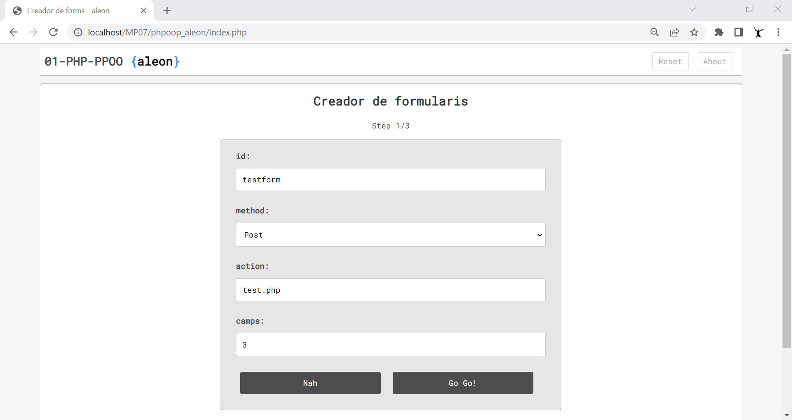
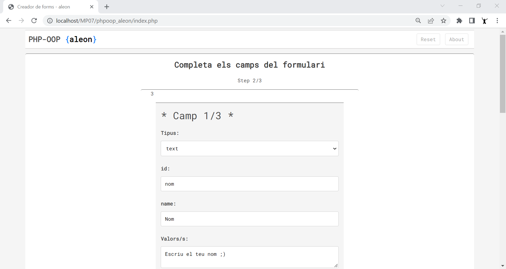
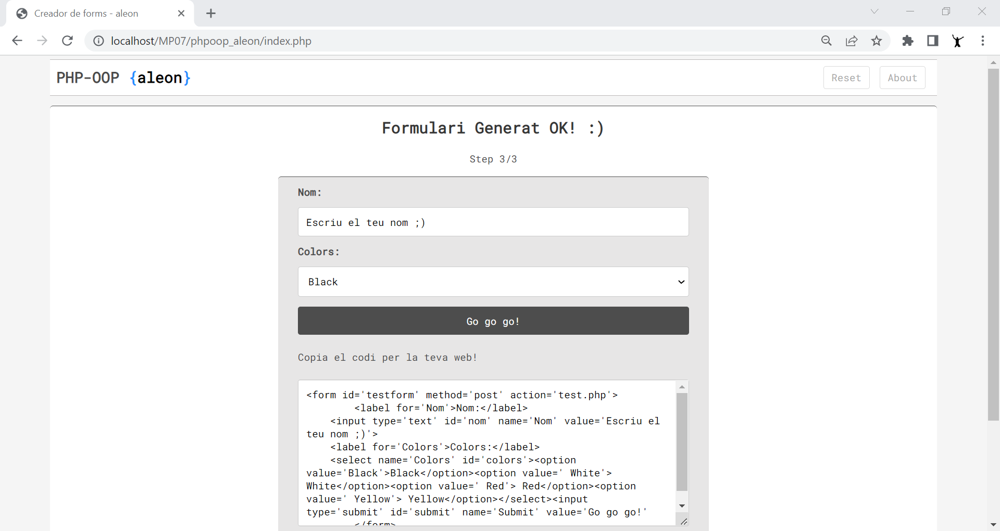

# PHP OOP Classes and Objects by aleon

Exemple en PHP utilitzant OOP (Object-oriented programming).
Creació d'un formulari HTML i els seus camps validats utilitzant classes, classes abstractes, constructor, herència, mètodes, mètodes estàtics, autoload i autoloader.

## Requeriments

🖥️ php -v
→ PHP 8.0.12 (cli)

## Get Started
- git clone https://github.com/aleongit/phpoop_aleon.git
- cd phpoop_aleon
- http://localhost/phpoop_aleon/ or apache site

